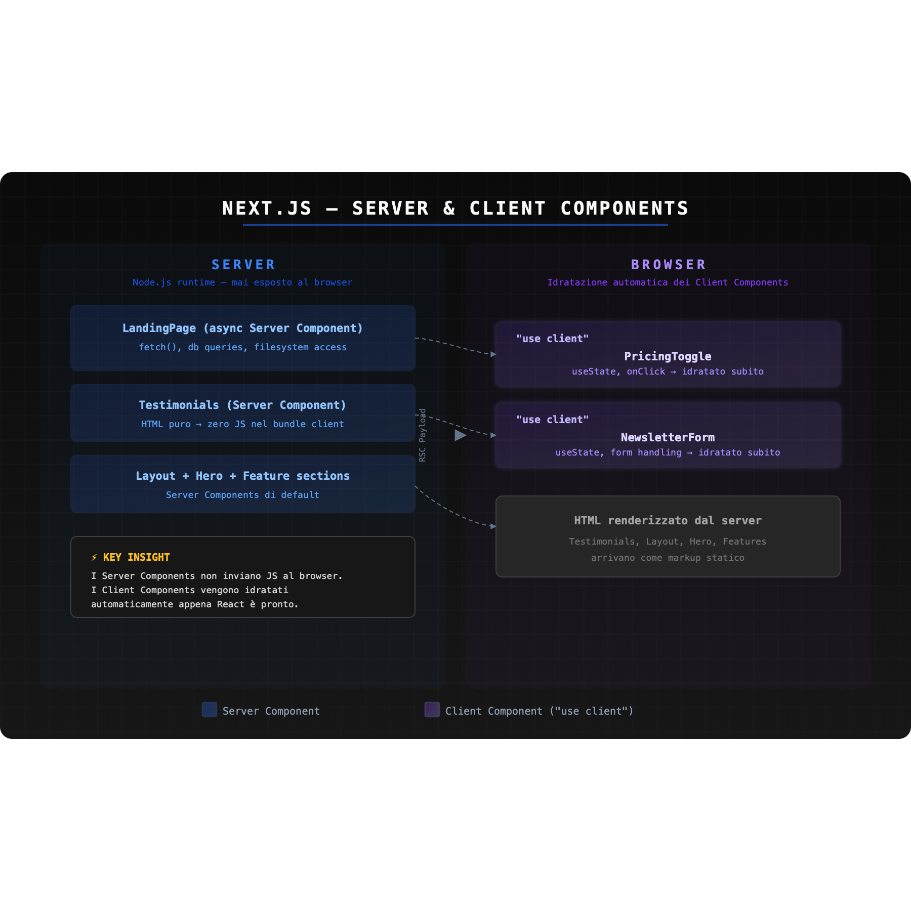
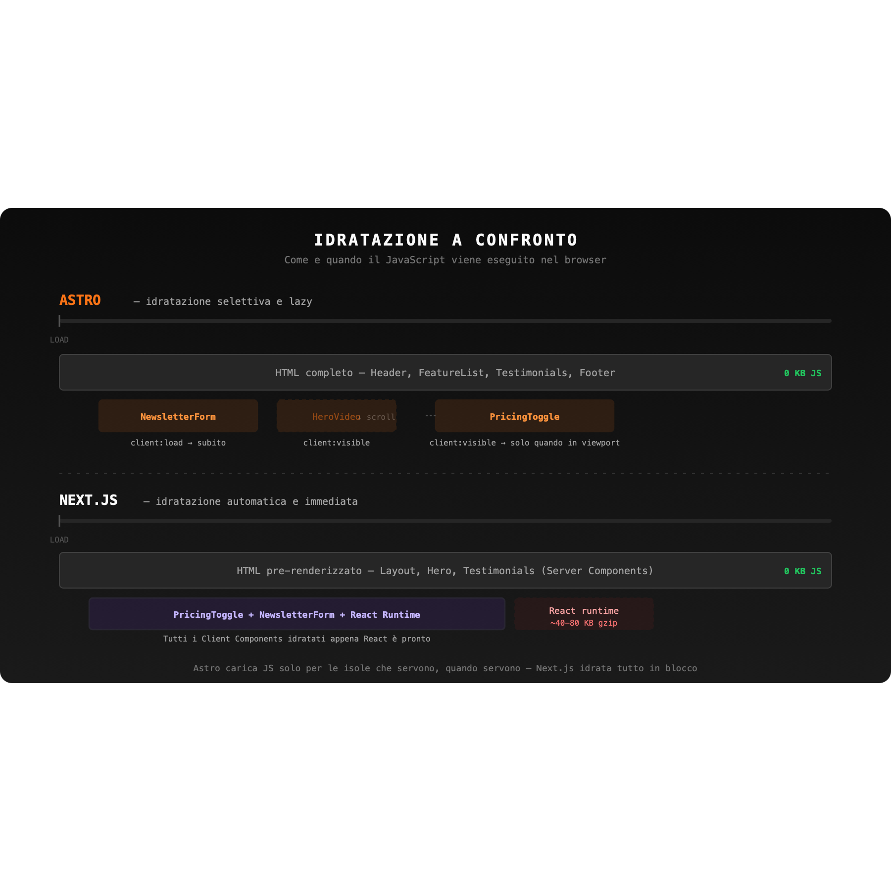

# Astro vs Next.js: due filosofie per costruire il web moderno

Sono anni interessanti per noi frontend... Abbiamo visto arrivare [Angular](https://angular.dev/), [React](https://react.dev/), [Vue](https://vuejs.org/), [Svelte](https://svelte.dev/), [Solid](https://www.solidjs.com/), meta-framework come [Next.js](https://nextjs.org/), [Nuxt](https://nuxt.com/) e [Remix](https://remix.run/), e poi è arrivato [Astro](https://astro.build/), con un approccio "zero JavaScript" che rompe le regole del gioco: oggi approfondiremo un po' di più questo framework, [che è stato recentemente da Cloudflare](https://blog.cloudflare.com/astro-joins-cloudflare/).

In questo ecosistema ricco e frammentato spesso facciamo sempre le stesse cose... Usiamo sempre lo stesso strumento, un po' perché lo conosciamo bene, un po' perché funziona, un po' per pigrizia... Next.js funziona? Sì, quasi sempre. Ma "funziona" non significa che sia sempre la scelta giusta.

In questo articolo paragoneremo Astro e Next.js, ma non vogliamo decretare un vincitore. Vogliamo rispondere a una domanda più utile: **quando ha senso usare Astro, e quando ha più senso usare Next.js?** Per rispondere bene, dobbiamo capire da dove vengono i due framework, cosa li muove sotto il cofano, e quali problemi ciascuno è davvero progettato per risolvere.

Sei pronto? Andiamo!

## Un po' di contesto: il problema del JavaScript nel browser

Prima di entrare nei dettagli tecnici, vale la pena fare un passo indietro.

Il web di oggi ha un problema di peso. Negli ultimi dieci anni, la quantità media di JavaScript scaricata da un browser per visitare una pagina web è cresciuta in modo esponenziale. Nel 2023, la mediana di script per pagina desktop superava i 500KB compressi, che diventano diversi megabyte una volta analizzati ed eseguiti dal motore del browser. Ci sono casi estremi: [pagine web che pesano da sole quasi 50MB](https://thatshubham.com/blog/news-audit)

Questo ha conseguenze reali: tempi di caricamento più lunghi, esperienze peggiori su dispositivi di fascia media o bassa, Core Web Vitals compromessi, e ranking SEO penalizzati.

Il problema non deriva dall'uso di React o di altri framework. Il problema è il modello di sviluppo che si è affermato: costruiamo app React complete anche quando stiamo costruendo siti che sono, fondamentalmente, contenuto. Un blog, una pagina marketing, una documentazione tecnica... Tutte queste pagine non hanno bisogno di un runtime JavaScript che gira nel browser per mostrare testo e immagini. Eppure è esattamente quello che succede quando usi un framework pensato per applicazioni interattive per costruire qualcosa che è, nella sostanza, statico.

È un po' come usare un camion per fare la spesa: funziona, ci arrivi al supermercato, ma stai portando con te un sacco di peso inutile, spendi un sacco di soldi di gasolio e oggi come oggi sappiamo quanto costa.

Astro e Next.js partono da risposte diverse a questo problema. Next.js dice: "ti do tutti gli strumenti per costruire qualsiasi cosa, e poi ottimizziamo insieme". Astro dice: "partiamo da zero JavaScript e aggiungiamo solo quello che serve davvero". Due filosofie opposte, entrambe legittime, ma con conseguenze molto diverse sul risultato finale.

## Next.js: il fullstack framework di riferimento per React

Next.js è sviluppato e mantenuto da [Vercel](https://vercel.com/). Negli anni è cresciuto fino a diventare molto più di un semplice layer sopra React: è diventato davvero una piattaforma fullstack che copre rendering, routing, gestione dei dati e deployment in modo integrato.

### Rendering modes

Una delle forze storiche di Next.js è la flessibilità nei modi di rendering:

- **Static Site Generation (SSG)**: le pagine vengono pre-renderizzate in fase di build e servite come asset statici
- **Server Side Rendering (SSR)**: le pagine vengono renderizzate a ogni richiesta (utile per contenuti personalizzati o dati in tempo reale)
- **Incremental Static Regeneration (ISR)**: un ibrido... Le pagine statiche vengono rigenerate in background con una frequenza configurabile

Vediamo un esempio di pagina rigenerata ogni ora.

```tsx
// SSG con revalidation ogni ora
export const revalidate = 3600

export default async function BlogPage() {
  const posts = await fetch("https://api.example.com/posts").then(res =>
    res.json()
  )

  return (
    <main>
      <h1>Blog</h1>
      {posts.map(post => (
        <article key={post.id}>
          <h2>{post.title}</h2>
          <p>{post.excerpt}</p>
        </article>
      ))}
    </main>
  )
}
```

### React Server Components



Con l'introduzione dell'App Router (Next.js 13+), il framework ha abbracciato i **React Server Components (RSC)**, uno dei cambiamenti più significativi nell'ecosistema React degli ultimi anni. I Server Components girano esclusivamente sul server. Non vengono mai idratati nel browser. Possono accedere direttamente a database, filesystem o API interne senza esporre nulla al client.

```tsx
// Questo componente non invia JavaScript al browser
async function UserProfile({ userId }: { userId: string }) {
  // Accesso diretto al database: impossibile con i Client Components
  const user = await db.users.findUnique({ where: { id: userId } })

  return (
    <div>
      <h2>{user.name}</h2>
      <p>{user.bio}</p>
    </div>
  )
}
```

I Client Components, invece, vengono dichiarati esplicitamente con la direttiva `"use client"` e gestiscono tutto ciò che richiede interattività lato browser.

```tsx
"use client"

import { useState } from "react"

export default function LikeButton({ initialCount }: { initialCount: number }) {
  const [count, setCount] = useState(initialCount)
  const [liked, setLiked] = useState(false)

  const handleLike = () => {
    setCount(prev => liked ? prev - 1 : prev + 1)
    setLiked(prev => !prev)
  }

  return (
    <button onClick={handleLike} className={liked ? "liked" : ""}>
      ♥ {count}
    </button>
  )
}
```

Questa distinzione è potente, ma introduce anche complessità: capire dove tracciare il confine tra Server e Client Components richiede esperienza e attenzione.

La regola pratica è semplice: un componente deve diventare Client Component solo se usa `useState`, `useEffect`, event handler del browser, o librerie che dipendono da API disponibili solo lato client (come `window` o `localStorage`). Tutto il resto (layout, sezioni statiche, componenti che si limitano a ricevere props e renderizzare HTML) può e dovrebbe restare Server Component.

Un errore comune nei principianti è mettere `"use client"` ovunque, spesso per abitudine o perché "così funziona". Il risultato è che l'intero albero di componenti viene spedito e idratato nel browser, annullando di fatto tutti i vantaggi del modello RSC. È come costruire una casa con porte blindate su ogni stanza invece che solo sull'ingresso.

Un secondo errore, meno ovvio, è il cosiddetto "client boundary creep": basta un `"use client"` su un componente padre per rendere automaticamente Client Components tutti i suoi figli, anche quelli che non ne avrebbero bisogno. 

La soluzione è progettare la gerarchia di componenti in modo che le parti interattive siano foglie dell'albero, non radici, e passare i Server Components come `children` ai Client Components quando possibile.

### API Routes e Server Actions

Next.js permette di definire endpoint backend direttamente nel progetto, nella stessa codebase del frontend:

```tsx
// app/api/subscribe/route.ts
export async function POST(request: Request) {
  const { email } = await request.json()

  await db.subscribers.create({ data: { email } })

  return Response.json({ success: true })
}
```

Con l'introduzione delle **Server Actions**, è possibile invocare logica server-side direttamente dai componenti React, senza dover definire endpoint separati:

```tsx
async function subscribeAction(formData: FormData) {
  "use server"
  const email = formData.get("email") as string
  await db.subscribers.create({ data: { email } })
}

export default function NewsletterForm() {
  return (
    <form action={subscribeAction}>
      <input name="email" type="email" placeholder="La tua email" />
      <button type="submit">Iscriviti</button>
    </form>
  )
}
```

Questo livello di integrazione tra frontend e backend è uno dei punti di forza più evidenti di Next.js per chi costruisce prodotti complessi. Un'unica codebase, un unico deploy, nessun context switch.

### Setup del progetto

Creare un progetto Next.js è questione di un comando:

```bash
npx create-next-app@latest my-app
```

La CLI ti chiede se vuoi TypeScript, ESLint e la struttura con `src/` directory... Tutte opzioni che puoi accettare o rifiutare. In pochi secondi hai un progetto funzionante con App Router, dev server con hot reload e tutto il necessario per iniziare a costruire.

## Astro: meno JavaScript, più performance

Astro nasce nel 2021 con un'idea precisa e radicale:

> La maggior parte del web non ha bisogno di tutto quel JavaScript.

Il suo principio fondante è **zero JavaScript by default**: se non lo richiedi esplicitamente, Astro non invia nulla di JavaScript al browser. Le pagine vengono compilate in HTML statico durante la build.

Vediamo un esempio concreto:

```astro
---
// Questo codice gira solo a build time (o sul server)
const title = "Benvenuto su Astro"
const posts = await fetch("https://api.example.com/posts").then(r => r.json())
---

<html>
  <head><title>{title}</title></head>
  <body>
    <h1>{title}</h1>
    <ul>
      {posts.map(post => (
        <li><a href={`/blog/${post.slug}`}>{post.title}</a></li>
      ))}
    </ul>
  </body>
</html>
```

Il risultato è HTML puro. Nessun runtime JavaScript. Nessuna idratazione. Il browser riceve esattamente quello che deve mostrare, senza dover eseguire codice aggiuntivo.

Questo si traduce in metriche eccellenti: Time to First Byte (TTFB) basso, Largest Contentful Paint (LCP) rapidissimo, e un Total Blocking Time (TBT) praticamente nullo per le pagine statiche.

Il risultato finale è HTML puro, niente JavaScript, tienilo a mente.

### Islands Architecture


La vera innovazione di Astro non è il rendering statico in sé, altri framework lo fanno da anni. Il vero "segreto" è il modello con cui gestisce le parti interattive: le **Islands**.

L'idea è semplice, ma allo stesso tempo rivoluzionaria: invece di rendere l'intera pagina un'applicazione React che poi viene idratata nel browser, Astro tratta la pagina come HTML statico con delle "isole" di interattività isolate. Ogni isola viene idratata in modo indipendente, solo quando necessario.

```astro
---
import Header from "../components/Header.astro"             // Statico
import HeroVideo from "../components/HeroVideo.jsx"         // Interattivo
import FeatureList from "../components/FeatureList.astro"   // Statico
import PricingToggle from "../components/PricingToggle.jsx" // Interattivo
import Footer from "../components/Footer.astro"             // Statico
---

<html>
  <body>
    <Header />
    <HeroVideo client:visible />
    <FeatureList />
    <PricingToggle client:visible />
    <Footer />
  </body>
</html>
```

Solo `HeroVideo` e `PricingToggle` inviano JavaScript al browser, e solo quando entrano nella viewport. `Header`, `FeatureList` e `Footer` sono HTML puro, zero JavaScript.

### Le direttive client

Astro offre un set di direttive per controllare con precisione quando e come un componente viene idratato:

| Direttiva | Quando avviene l'idratazione |
|---|---|
| `client:load` | Immediatamente al caricamento della pagina |
| `client:visible` | Quando il componente entra nella viewport (usa l'Intersection Observer) |
| `client:idle` | Quando il browser è inattivo (requestIdleCallback) |
| `client:media` | Quando una media query diventa vera |
| `client:only` | Solo client-side, senza SSR del componente |

L'**Intersection Observer** è una API nativa del browser che notifica il tuo codice nel momento in cui un elemento entra o esce dalla viewport, senza dover ascoltare l'evento `scroll` e calcolare posizioni manualmente. 

È efficiente perché il browser gestisce il tracciamento in modo asincrono, senza bloccare il thread principale. Astro lo usa internamente per `client:visible`: il componente viene idratato solo quando l'utente sta effettivamente per vederlo, non prima.

Questo livello di controllo granulare è qualcosa che Next.js non offre nativamente. In Next.js puoi ottimizzare con i Server Components, ma l'idratazione dei Client Components è automatica e immediata non appena vengono inclusi nella pagina.

### Framework agnostic

Un altro punto di forza di Astro spesso sottovalutato: non sei vincolato a React. Puoi usare componenti Vue, Svelte, Solid, [Lit](https://lit.dev/), o anche mescolare framework diversi nella stessa pagina. 

Immagina di lavorare con un collega che conosce solo Svelte mentre tu hai sempre fatto React: con Astro potete lavorare sullo stesso progetto senza che nessuno dei due debba imparare qualcosa di nuovo. Non è uno scenario comune, ma quando capita, è una salvezza.

```astro
---
import ReactCounter from "../components/Counter.jsx"   // React
import VueCarousel from "../components/Carousel.vue"   // Vue
import SvelteModal from "../components/Modal.svelte"   // Svelte
---

<main>
  <ReactCounter client:load />
  <VueCarousel client:visible />
  <SvelteModal client:load />
</main>
```

Per un team che migra gradualmente da un framework a un altro, o che ha competenze miste, questa flessibilità è preziosa. E per chi vuole sperimentare con Svelte o Solid senza riscrivere tutto, è un'opzione interessante.

### Setup del progetto

Creare un progetto Astro è davvero semplice: basta un comando nel terminale per avere tutto pronto.

```bash
npm create astro@latest my-project
```

La CLI interattiva ti guida nella scelta del template e delle opzioni base. Una volta creato il progetto, se hai bisogno di componenti interattivi, come nell'esempio che vedremo il pricing toggle e il form, aggiungi l'integrazione con il framework che preferisci. Per React, ad esempio:

```bash
npx astro add react
```

Astro installa automaticamente le dipendenze necessarie (`react`, `react-dom`, `@astrojs/react`) e aggiorna la configurazione in `astro.config.mjs`. Non devi toccare nulla a mano. Lo stesso vale per Vue (`astro add vue`), Svelte (`astro add svelte`) o qualsiasi altra [integrazione supportata ufficialmente](https://astro.build/integrations/).

Questo approccio modulare è una delle caratteristiche distintive di Astro: parti leggero e aggiungi solo quello che ti serve, quando ti serve. Non porti con te il peso di un runtime che non usi.

La struttura del progetto è semplice e prevedibile: le pagine vivono in `src/pages/`, i componenti in `src/components/`, e ogni file `.astro` ha un frontmatter delimitato da `---` dove puoi scrivere logica server-side in JavaScript o TypeScript. Se hai mai lavorato con file Markdown con frontmatter YAML, il concetto ti sarà familiare, solo che qui il frontmatter è codice eseguibile.

Il routing funziona esattamente come in Next.js: è **file-based**. Un file `src/pages/about.astro` diventa `/about`, un file `src/pages/blog/[slug].astro` diventa una rotta dinamica `/blog/qualsiasi-slug`. 

Se hai già usato il Pages Router di Next.js, ti sentirai subito a casa. La differenza è che Next.js ha poi introdotto l'App Router, con le cartelle `app/` e i file speciali `page.tsx`, `layout.tsx`, `loading.tsx`, aggiungendo potenza ma anche complessità. 

Astro resta sul modello più semplice: un file, una rotta, nessuna convenzione da imparare.

## Confronto diretto: una pagina marketing

Mettiamo tutto insieme con un esempio concreto. Dobbiamo costruire una landing page con:

- Hero con video di background
- Sezione feature in testo
- Toggle per la visualizzazione dei prezzi mensili/annuali
- Testimonianze caricate da una API esterna
- Form di iscrizione alla newsletter

Le testimonianze sono un caso interessante: vengono da un CMS esterno, cambiano raramente, e non hanno bisogno di interattività. È esattamente il tipo di dato che i due framework gestiscono in modo molto diverso.

Una nota pratica: negli esempi di codice che seguono, l'articolo mostra una `fetch` verso un'API esterna (`https://api.example.com/testimonials`). Nel codice reale allegato all'articolo non c'è nessuna API. Le testimonianze vengono da un semplice file JSON locale (`src/data/testimonials.json`) importato direttamente nel componente. 

Il concetto è lo stesso: i dati arrivano al browser già renderizzati come HTML, senza JavaScript. 

Abbiamo anche semplificato l'hero, sostituendo il video di background con un gradiente CSS, per mantenere gli esempi leggeri e facili da eseguire senza dipendenze esterne.

### Fetch dei dati: Astro

In Astro, il fetch avviene nel frontmatter, la sezione delimitata dai `---` che abbiamo visto nel setup. Quel codice gira **solo sul server** (o a build time), mai nel browser.

```astro
---
// src/pages/index.astro
import PricingToggle from "../components/PricingToggle.jsx"
import NewsletterForm from "../components/NewsletterForm.jsx"

// Questo fetch avviene a build time (o a ogni richiesta con SSR abilitato)
// Il browser non vede nulla di questo codice
const res = await fetch("https://api.example.com/testimonials")
const testimonials = await res.json()
---

<html>
  <body>

    <section class="hero">
      <h1>Il nostro prodotto</h1>
      <p>La soluzione più veloce per il tuo team.</p>
    </section>

    <section class="pricing">
      <h2>Prezzi chiari, senza sorprese</h2>
      <!-- Caricato solo quando entra nel viewport -->
      <PricingToggle client:visible />
    </section>

    <!-- Le testimonianze sono HTML puro: zero JavaScript -->
    <section class="testimonials">
      <h2>Cosa dicono di noi</h2>
      {testimonials.map(t => (
        <blockquote>
          <p>{t.quote}</p>
          <cite>- {t.author}, {t.company}</cite>
        </blockquote>
      ))}
    </section>

    <section class="newsletter">
      <h2>Resta aggiornato</h2>
      <!-- Idratato subito -->
      <NewsletterForm client:load />
    </section>

  </body>
</html>
```

Il risultato nel browser è HTML puro. Le testimonianze sono già lì, nel markup, senza una singola riga di JavaScript eseguita per mostrarle. `PricingToggle` e `NewsletterForm` sono le uniche due isole interattive, e ognuna viene idratata nei propri tempi.

### Fetch dei dati: Next.js

In Next.js con l'App Router, il fetch avviene direttamente nei Server Components: funzioni `async` che girano sul server e passano i dati ai componenti figli.

```tsx
// app/page.tsx
import PricingToggle from "@/components/pricing-toggle"   // internamente "use client"
import NewsletterForm from "@/components/newsletter-form" // internamente "use client"

// Questo è un Server Component: gira solo sul server
export default async function LandingPage() {
  // Il fetch avviene sul server - nessun problema di CORS, nessuna chiave API esposta
  const res = await fetch("https://api.example.com/testimonials", {
    next: { revalidate: 3600 } // ISR: rigenera i dati ogni ora
  })
  const testimonials = await res.json()

  return (
    <main>

      <section className="hero">
        <h1>Il nostro prodotto</h1>
        <p>La soluzione più veloce per il tuo team.</p>
      </section>

      <section className="pricing">
        <h2>Prezzi chiari, senza sorprese</h2>
        {/* PricingToggle è un Client Component: viene idratato automaticamente */}
        <PricingToggle />
      </section>

      {/* Le testimonianze vengono da un Server Component: HTML puro, niente JS */}
      <section className="testimonials">
        <h2>Cosa dicono di noi</h2>
        {testimonials.map((t: Testimonial) => (
          <blockquote key={t.id}>
            <p>{t.quote}</p>
            <cite>- {t.author}, {t.company}</cite>
          </blockquote>
        ))}
      </section>

      <section className="newsletter">
        <h2>Resta aggiornato</h2>
        {/* NewsletterForm è un Client Component */}
        <NewsletterForm />
      </section>

    </main>
  )
}
```

Nota l'opzione `{ next: { revalidate: 3600 } }`: è un'estensione di Next.js all'API `fetch` nativa che attiva l'**Incremental Static Regeneration**. I dati vengono cachati e rigenerati in background ogni ora, senza dover fare un nuovo fetch a ogni richiesta.

### Il punto di differenza



Guardando i due esempi fianco a fianco, la logica di fetch è sorprendentemente simile: in entrambi i casi il codice gira sul server, i dati arrivano al browser come HTML, e nessuna chiave API viene esposta al client.

La differenza è nel **controllo dell'idratazione**.

In Astro, `PricingToggle` viene idratato quando entra nella viewport. `NewsletterForm` è subito. Il resto è inerte.

In Next.js, `PricingToggle` e `NewsletterForm` vengono idratati non appena React è pronto nel browser, anche se l'utente non ha ancora scrollato fino al pricing. Non è necessariamente un problema, ma è un comportamento che Astro ti permette di controllare con precisione chirurgica.

Per questa pagina specifica la differenza di performance è probabilmente trascurabile. Su una pagina con dieci componenti interattivi, inizia a diventare rilevante. Su un sito con centinaia di pagine come questa, è la differenza tra un Lighthouse score di 95 e uno di 75.

## Developer Experience a confronto

La performance non è l'unico asse di confronto. Vale la pena considerare anche l'esperienza di sviluppo quotidiana, perché il framework con cui lavori ogni giorno incide direttamente sulla tua produttività e sulla qualità del risultato finale.

### Next.js

Se conosci React, con Next.js sei già a metà strada. L'ecosistema è maturo, la documentazione è eccellente e la community è enorme... Significa che per quasi ogni problema che incontri, qualcuno ha già trovato una soluzione, senza dimenticare il supporto dell'AI.

Il modello mentale dei Server Components richiede un po' di adattamento iniziale: devi abituarti a ragionare su quali componenti girano sul server e quali nel browser. Ma una volta acquisito, è un modello potente che ti permette di scrivere meno codice client-side senza sacrificare l'interattività.

Il dev server con hot reload è veloce e affidabile. [TypeScript](https://www.typescriptlang.org/) è first-class citizen: i tipi vengono generati automaticamente per le route e i parametri. L'integrazione nativa con Vercel rende il deploy un non-problema... 

Un `git push` e il sito è online. Ma puoi fare deploy anche su altre piattaforme: Docker, Node.js standalone, o qualsiasi provider che supporti le serverless functions.

L'ecosistema di librerie compatibili è praticamente illimitato. Autenticazione, ORM, state management, UI kit. Se esiste per React, funziona con Next.js. Questo è un vantaggio concreto quando lavori in team o su progetti di lunga durata: non devi reinventare la ruota.

### Astro

Astro ha una curva di apprendimento sorprendentemente bassa, soprattutto se vieni dal mondo HTML/CSS. La sintassi dei file `.astro` è familiare: un frontmatter JavaScript in cima e template HTML con espressioni sotto. Non c'è un paradigma nuovo da imparare. È il web che conosci già, con un po' di superpotere in più.

La documentazione è eccellente e ben organizzata, con guide pratiche che ti portano da zero a un sito funzionante in pochi minuti. Il dev server è rapido e la build è tipicamente molto veloce, anche su progetti con centinaia di pagine.

Il punto di attenzione sono le Islands: devi pensare in anticipo a quali parti della pagina sono statiche e quali interattive. Questo richiede un cambio di mentalità rispetto allo sviluppo React tradizionale, dove tutto è un componente e tutto è potenzialmente interattivo. Ma è un vincolo che tende a produrre architetture più pulite e risultati più performanti: ti costringe a farti la domanda giusta: "questo componente ha davvero bisogno di JavaScript nel browser?"

Un aspetto spesso sottovalutato: Astro si integra facilmente con CMS headless come [Contentful](https://www.contentful.com/), [Sanity](https://www.sanity.io/), [Storyblok](https://www.storyblok.com/) o anche file Markdown locali. 

Per siti editoriali gestiti da team non tecnici, questa è spesso la killer feature: il content team lavora nel CMS, lo sviluppatore definisce i template, e Astro genera pagine statiche velocissime senza che nessuno debba toccare codice.

### Debugging e tooling

Su entrambi i framework, il debugging è un'esperienza solida. Next.js si integra nativamente con i React DevTools e offre messaggi di errore dettagliati con overlay nel browser. Astro mostra errori chiari nel terminale e nel browser, con stack trace che puntano direttamente al file `.astro` sorgente, non al codice compilato.

Entrambi i framework includono una **dev toolbar** integrata nel browser durante lo sviluppo: una barra in basso alla pagina che mostra informazioni utili, permette di ispezionare le isole (Astro) o i Server/Client Components (Next.js), e dà accesso a impostazioni rapide senza dover aprire il terminale. In Astro la toolbar mostra visivamente i confini di ogni isola: utile per capire a colpo d'occhio cosa è statico e cosa è interattivo.

Un punto a favore di Astro: quando qualcosa non funziona, il modello mentale è più semplice da debuggare. Se un componente non si idrata, sai esattamente dove guardare: la direttiva `client:*` nel template. In Next.js, capire perché un componente sta girando sul server o sul client può richiedere qualche passaggio in più, soprattutto nei casi limite tra Server e Client Components.

## Quando scegliere Astro

Astro è la scelta giusta quando la **performance e il contenuto sono la priorità assoluta**:

- **Blog e magazine digitali**: il contenuto cambia raramente, l'interattività è minima
- **Documentazione tecnica**: velocità di navigazione e SEO sono critici
- **Siti marketing e landing page**: ogni millisecondo di LCP conta per le conversioni
- **Portfolio e siti personali**: semplicità e leggerezza prima di tutto
- **Siti editoriali con CMS**: dove il contenuto è il prodotto

Se il tuo sito è principalmente contenuto con qualche spruzzata di interattività, Astro ti darà una velocità difficile da battere con qualsiasi altra soluzione, con meno configurazione e meno codice.

## Quando scegliere Next.js

Next.js è la scelta giusta quando stai costruendo una **vera applicazione web**:

- **SaaS e prodotti con autenticazione**: gestione di sessioni, ruoli, dati utente
- **Dashboard e interfacce complesse**: molto stato, navigazione dinamica, aggiornamenti in tempo reale
- **E-commerce con logica dinamica**: carrello, checkout, personalizzazione, inventory in tempo reale
- **Applicazioni con API backend integrate**: quando vuoi un'unica codebase per frontend e backend
- **Prodotti che crescono nel tempo**: ecosistema maturo, TypeScript eccellente, adatto a team grandi

Se il tuo prodotto vive di stato, autenticazione, logica di business e interazione continua con il server, Next.js ti offre tutto ciò di cui hai bisogno senza dover assemblare pezzi di librerie diverse.

## Una nota sul futuro

Il confine tra i due framework si sta assottigliando. Astro ha introdotto il supporto per le **server routes** e le **actions**, avvicinandosi al mondo delle applicazioni fullstack. Next.js con i Server Components si è avvicinato al modello "meno JavaScript nel browser" che Astro ha sempre promosso.

Non è detto che tra qualche anno le differenze siano ancora così nette. Ma oggi rimangono due strumenti con identità distinte e casi d'uso ben definiti. La convergenza è un segnale positivo: il settore sta riconoscendo che spedire meno JavaScript al browser è quasi sempre una buona idea, e che il rendering server-side non è una feature opzionale ma un punto di partenza.

## Conclusione

Astro e Next.js non sono in competizione: risolvono problemi diversi, con filosofie diverse.

**Astro** parte dal contenuto e aggiunge interattività solo dove serve. Il risultato sono pagine veloci, leggere, ottimizzate per il web che la maggior parte degli utenti visita ogni giorno.

**Next.js** parte dall'applicazione e ottimizza il rendering dove può. Il risultato è una piattaforma completa per costruire prodotti digitali complessi, scalabili e manutenibili nel tempo.

La domanda giusta non è *"quale framework è migliore?"*. È *"cosa sto costruendo, e per chi?"*

Se è un sito dove il contenuto è il valore: Astro.
Se è un'applicazione dove l'interazione è il valore: Next.js.

E se non sei sicuro? Inizia dall'utente. Dove vive la sua esperienza? Nella lettura o nell'interazione? La risposta è lì, non nel framework.
